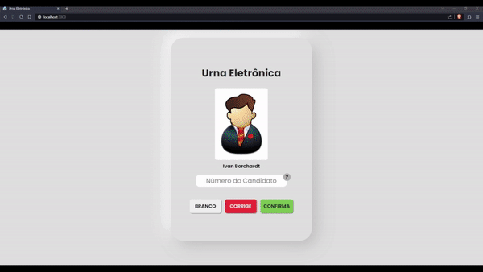

# Urna Eletrônica

Estou movendo o diretório, todos os commits estão [aqui](https://github.com/evandroreichert/exerciciosNode/tree/7957837285c6f00be345f2ae85b0c11a0c2ef445)



Vídeo com som [aqui](https://www.youtube.com/watch?v=Hsa6CvHgQMM)

## Funcionalidades

### 00. Protótipo da tela principal

- Campo para digitação do número eleitoral.
- Apresentação do nome e foto do candidato.
- Botões "Confirmar", "Corrige", "Branco".

### 01. Carga inicial de candidatos e configurações

- Projeto Node.js com Express para rotas do sistema de eleições.
- Arquivo `config.csv` com formato: (tipoEleicao, numeroCandidato, nomeCandidato, urlFoto).
- Endpoint ([get]/cargainicial) para fornecer dados do arquivo `config.csv`.
- Ajuste na tela conforme dados recebidos.

### 02. Registro de Votos

- Endpoint ([POST]/voto) para salvar votos em `votacao.csv`.
- Formato do arquivo: (numeroCandidato, timestampVoto).
- Resposta em JSON para sucesso ou erro.
- Função no frontend para requisições ao endpoint.
- Exibição de mensagens na tela.
- Som idêntico ao da urna original ao confirmar o voto.
- Som de erro ao ocorrer falha no registro do voto.

### 03. Apuração dos votos

- Endpoint ([get]/apuracao) para retornar apuração dos votos.
- Contagem de votos de cada candidato, votos brancos e nulos.
- Retorno em array ordenado pela quantidade de votos.


## Como Usar

1. Clone o repositório:

    ```bash
    git clone https://github.com/evandroreichert/urnaEletronica.git
    ```

2. Navegue até o diretório da Urna Eletrônica:

    ```bash
    cd urnaEletronica
    ```

3. Instale as dependências:

    ```bash
    npm install
    ```

4. Inicie o servidor:

    ```bash
    node server.js
    ```

5. Abra um navegador e acesse [http://localhost:3000](http://localhost:3000).

6. Interaja com a urna eletrônica para simular o processo de votação.
